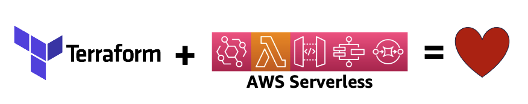

# reinvent2024-svs320

## Accelerate serverless deployments using Terraform with proven patterns
This repo contains QR codes and links used in the AWS re:Invent 2024 SVS320 session. In this session, discover best practices and proven patterns for using Terraform to build serverless applications safely, predictably, and repeatedly. Learn techniques for designing modular, reusable architectures and strategies to test applications locally. Understand how to manage ownership and separation of concerns between operations and development teams. Gain insights into efficiently deploying serverless applications to the cloud. Familiarize yourself with open source frameworks to accelerate your serverless journey with Terraform today. Leave equipped with practical skills for leveraging Terraform’s power in your organization’s modern cloud architectures.

## Slides
* [Session presentation slides](./SVS320_terraform_for_serverless.pdf?raw=true)

## Next Steps
* [[Guide] Building Serverless Applications with Terraform](https://serverlessland.com/content/guides/building-serverless-applications-with-terraform/01-introduction)
* [[Workshop] Building Serverless Applications with Terraform](https://catalog.us-east-1.prod.workshops.aws/workshops/15e690e4-c067-45e9-a72e-dfef1c3678a0/en-US)
* [[Guide] AWS Terraform Provider Best Practices](https://docs.aws.amazon.com/prescriptive-guidance/latest/terraform-aws-provider-best-practices/introduction.html)
* [[Webinar] Scaling Serverless Development with Platform Engineering (requires registration)](https://www.bigmarker.com/techstrong/Scaling-Serverless-Development-With-Platform-Engineering-A-Blueprint-for-Success)
* [[Guide] Implementing governance in depth for serverless applications](https://serverlessland.com/content/service/lambda/guides/governance/1-introduction)
* [[Samples] Integration patterns with Terraform Modules](https://serverlessland.com/patterns?framework=Terraform+%28with+modules%29)
* [[Guide] Terraform resources by Anton Babenko](https://github.com/antonbabenko/terraform-aws-devops)

## QR-Codes and links shown throughout the session
* [Configuring AWS Terraform Provider authentication](https://registry.terraform.io/providers/hashicorp/aws/latest/docs#authentication-and-configuration)
* [AWS IAM - alternatives to long term access keys](https://docs.aws.amazon.com/IAM/latest/UserGuide/security-creds.html#sec-alternatives-to-long-term-access-keys)
* [Using AWS Terraform Provider default_tags](https://registry.terraform.io/providers/hashicorp/aws/latest/docs#default_tags)
* [Terraform resource: aws_s3_bucket](https://registry.terraform.io/providers/hashicorp/aws/latest/docs/resources/s3_bucket)
* [Terraform resource: aws_sqs_queue](https://registry.terraform.io/providers/hashicorp/aws/latest/docs/resources/sqs_queue)
* [Terraform resource: aws_iam_policy](https://registry.terraform.io/providers/hashicorp/aws/latest/docs/resources/iam_policy)
* [Terraform resource: aws_lambda_function](https://registry.terraform.io/providers/hashicorp/aws/latest/docs/resources/lambda_function)
* [Testing serverless applications with SAM](https://aws.amazon.com/blogs/compute/aws-sam-support-for-hashicorp-terraform-now-generally-available)
* [Testing serverless applications with LocalStack](https://www.youtube.com/live/2QYlxx13j5A)
* [Terraform modules](https://developer.hashicorp.com/terraform/language/modules)
* [Serverless.tf](https://serverless.tf)

## By Anton Babenko

* [Terraform Best Practices (free ebook)](https://www.terraform-best-practices.com/)
* [serverless.tf - Doing Serverless on AWS with Terraform](https://serverless.tf)
* [Terraform Weekly newsletter](https://weekly.tf/)
* [Terraform AWS modules (open-source)](https://github.com/terraform-aws-modules)
* [Your Weekly Dose of Terraform live-streams](https://bit.ly/terraform-youtube)
* [!NEW! Making your Terraform modules compliance-ready](https://compliance.tf)
